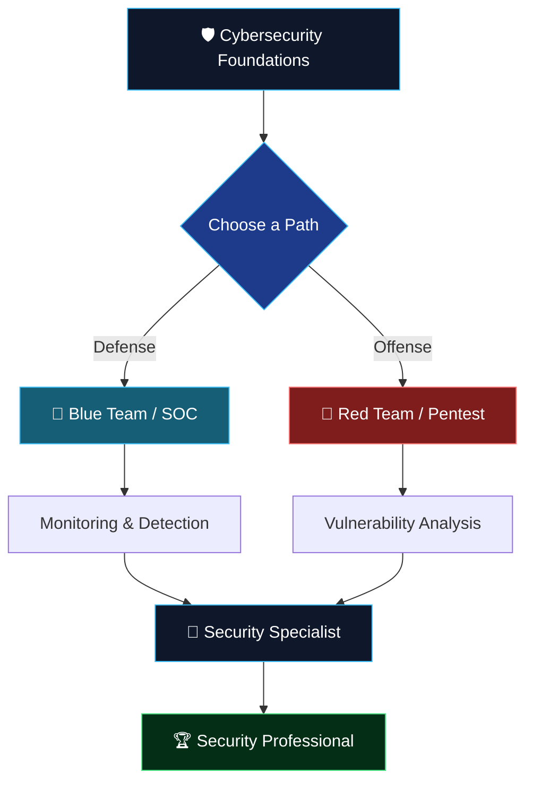

<div align="center">


<br>


<a href="https://linkedin.com/in/rupam-pal-5b22b8411"></a>
<a href="https://github.com/ItzRealRUPAM"></a>

</div>

<br>

## 🧑‍💻 About Me

```yaml
name: Rupam Pal
role: B.Sc. Cybersecurity Student
based_in: West Bengal, India
languages_spoken: [Bengali, Hindi, English]
currently_learning: [C Programming, Linux Internals, Cybersecurity Fundamentals]
daily_driver_os: Omarchy Linux (Arch-based, Hyprland)
also_uses: [Kali Linux, Ubuntu, ChromeOS Flex + Penguin (Debian terminal)]
philosophy: "1% better every day — learn, build, break, fix, repeat"
current_focus: Blue Team foundations → long-term goal Red Team / Offensive Security
```

I'm not chasing overnight mastery — I'm stacking small, real wins every day. Every project below is something I've actually built and broken and fixed myself, not a tutorial I just watched.

---

## ⚔️ The Path I'm Walking

<div align="center">



</div>

---

## 🛠️ Tech Stack

<div align="center">

**Programming & Scripting**


**Systems & Tools**


**Productivity**


</div>

---

## 🚀 Featured Projects

<table>
<tr>
<td width="50%" valign="top">

### 🤖 Ahana — Personal AI Companion

A voice-first desktop AI companion built from scratch on my own Linux machine — not a wrapper around a chatbot, but a full system with memory, personality, and real computer access.

- 🎤 Voice input/output (Bengali TTS voice)
- 🧠 Long-term SQLite memory with proactive fact-saving
- 🗣️ Speaks Benglish, has a defined personality and boundaries
- 💻 Cross-platform system control (Linux / WSL / Windows)
- 🔌 Portable USB build that runs on any of the three
- 😴 Wake-word behavior with idle/sleep detection
- 🚧 In progress: keyword-based mid-speech interrupt system

**Status:** 🟡 Actively being built

</td>
<td width="50%" valign="top">

### 💪 RPG Fitness Tracker

An offline, HTML-based fitness tracker that turns daily workouts into an RPG progression system.

- ⚔️ Daily quests instead of plain to-do items
- ⭐ XP + leveling system for consistency
- 🏆 Unlockable badges
- 📊 Visual progress tracking
- 🌙 Automatic daily reset
- 📱 Mobile-friendly layout

**Status:** 🟡 Experimental

</td>
</tr>
</table>

---

## 🧠 Current Learning Map

<table align="center">
<tr><th>Area</th><th>Status</th><th>Notes</th></tr>
<tr><td>💻 C Programming</td><td>🟡 In Progress</td><td>Comfortable through switch-case, pushing further</td></tr>
<tr><td>🐧 Linux</td><td>🟡 In Progress</td><td>Daily-driving Omarchy (Arch + Hyprland), also used Kali & Ubuntu</td></tr>
<tr><td>🛡️ Cybersecurity Fundamentals</td><td>🟡 In Progress</td><td>Core B.Sc. coursework</td></tr>
<tr><td>🌐 Git & GitHub</td><td>🟡 In Progress</td><td>Version control for all active projects</td></tr>
<tr><td>🤖 AI/Applied AI</td><td>🟢 Foundations Done</td><td>Completed intro coursework, now building real projects</td></tr>
<tr><td>🌐 Networking</td><td>🔴 Upcoming</td><td>Next on the roadmap</td></tr>
<tr><td>🗄️ SQL</td><td>🔴 Upcoming</td><td>Planned</td></tr>
<tr><td>🐍 Python</td><td>🔴 Upcoming</td><td>Planned depth beyond scripting basics</td></tr>
<tr><td>🔵 Blue Team / SOC</td><td>🔴 Upcoming</td><td>First specialization target</td></tr>
<tr><td>🔴 Red Team</td><td>⚪ Future Goal</td><td>Long-term direction</td></tr>
</table>

---

## 📚 Learning Philosophy

<div align="center">

### 🎯 1% Better Every Day

<table>
<tr>
<td align="center">📖<br><b>LEARN</b></td>
<td>→</td>
<td align="center">✍️<br><b>WRITE</b></td>
<td>→</td>
<td align="center">💻<br><b>CODE</b></td>
<td>→</td>
<td align="center">🧪<br><b>TEST</b></td>
</tr>
<tr>
<td align="center">💥<br><b>BREAK</b></td>
<td>→</td>
<td align="center">🔧<br><b>FIX</b></td>
<td>→</td>
<td align="center">🚀<br><b>BUILD</b></td>
<td>→</td>
<td align="center">🔁<br><b>REPEAT</b></td>
</tr>
</table>

> **Watching a tutorial is not the finish line. Building something — and breaking it — is.**

</div>

---

## 🏆 Completed Learning

- 🎓 Google AI Essentials
- 🤖 PrepInsta AI Course
- 🤖 Adda247 AI Course

**Currently learning:** C Programming • Linux • Cybersecurity Fundamentals

---

## 📈 GitHub Activity

<div align="center">


</div>

---

## 🌐 Let's Connect

<div align="center">

<a href="https://linkedin.com/in/rupam-pal-5b22b8411"></a>
<a href="https://github.com/ItzRealRUPAM"></a>

<br><br>

```bash
$ whoami
Rupam Pal — learning today so I'm dangerous (in a good way) tomorrow.
```

### ⚡ Learn. Build. Break. Fix. Repeat.

</div>


